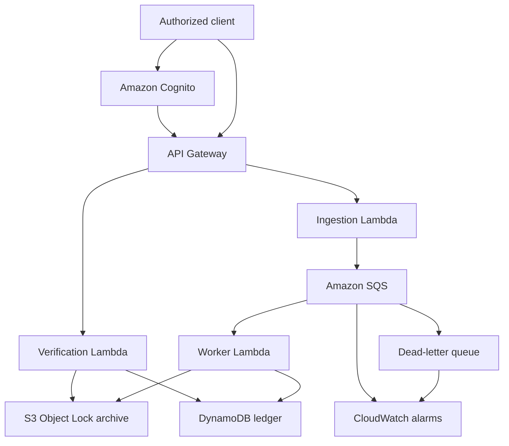
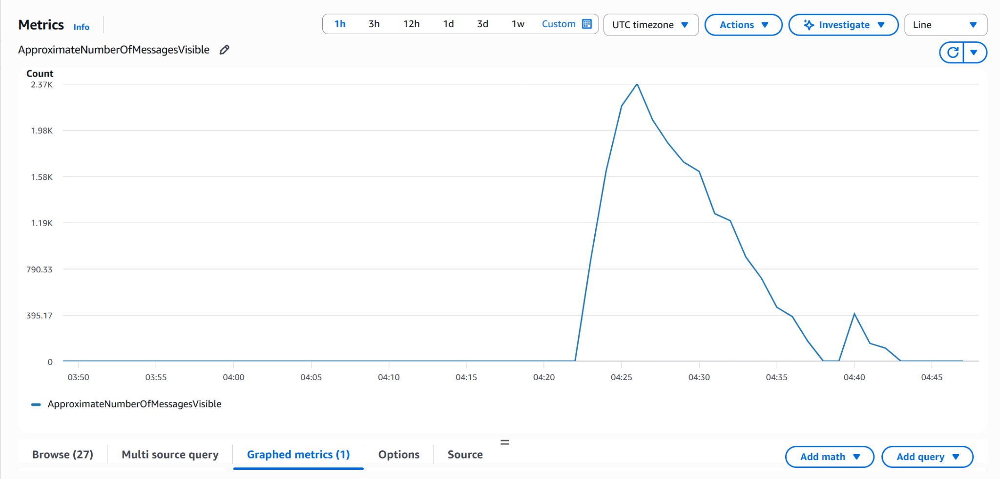
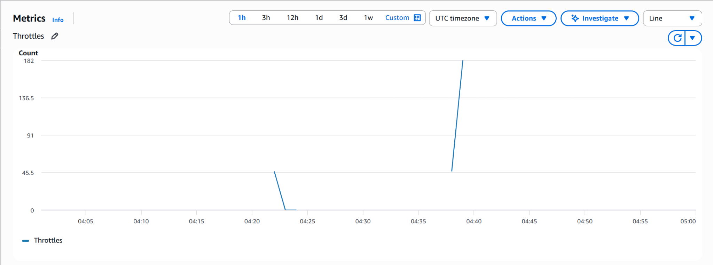

# CareTrail

[](https://github.com/smritiig/caretrail/actions/workflows/ci.yml)

CareTrail is a serverless healthcare audit ledger built with Python and AWS. It receives security-sensitive audit events, processes them asynchronously, and preserves tamper-evident copies for later integrity verification.

The project demonstrates backend engineering, event-driven architecture, infrastructure as code, cloud security, failure recovery, and automated testing.

> CareTrail is a portfolio project demonstrating healthcare-oriented security patterns. It is not presented as a certified HIPAA-compliant product.

## The problem

Healthcare systems need to record who accessed or changed sensitive patient information.

A normal application log is insufficient because it may be:

- Modified or deleted after a security incident
- Lost when a downstream service becomes unavailable
- Written twice when a message is retried
- Difficult to verify during an investigation
- Exposed through an unauthenticated endpoint

CareTrail addresses these problems through authenticated ingestion, asynchronous processing, immutable object storage, idempotent database writes, dead-letter recovery, and cryptographic integrity checks.

## Architecture



## Event workflow

1. A client authenticates through Amazon Cognito and receives a JWT.
2. The client sends an audit event to `POST /audit-events`.
3. API Gateway validates the JWT before invoking the ingestion Lambda.
4. The ingestion Lambda validates the payload with Pydantic.
5. The validated event is placed onto Amazon SQS.
6. The worker Lambda reads the message asynchronously.
7. A canonical JSON representation and SHA-256 hash are created.
8. The event is archived in a versioned S3 bucket protected by Object Lock.
9. The event, hash, S3 key, and exact S3 version ID are stored in DynamoDB.
10. Failed messages are retried and eventually moved to a dead-letter queue.
11. `GET /audit-events/{event_id}/verify` recalculates both stored hashes and reports whether the event remains intact.

## Example audit event

```json
{
  "event_id": "evt-1001",
  "actor_id": "doctor-27",
  "patient_id": "patient-104",
  "action": "PATIENT_RECORD_VIEWED",
  "outcome": "SUCCESS",
  "occurred_at": "2026-09-20T15:30:00Z"
}
```

## API endpoints

| Method | Route | Purpose | Authentication |
|---|---|---|---|
| `POST` | `/audit-events` | Validate and enqueue an audit event | Cognito JWT |
| `GET` | `/audit-events/{event_id}/verify` | Verify DynamoDB and S3 integrity | Cognito JWT |

A successful ingestion returns:

```json
{
  "event_id": "evt-1001",
  "status": "accepted"
}
```

A successful integrity check returns:

```json
{
  "event_id": "evt-1001",
  "status": "VERIFIED"
}
```

Possible verification results are:

- `VERIFIED` — both stored copies match the expected hash
- `FAILED` — one or both copies have been modified
- `NOT_FOUND` — the event does not exist

## Reliability and security

- Cognito JWT authorization on every API route
- Strict Pydantic request validation
- Asynchronous ingestion through SQS
- Partial batch failure reporting
- Automatic retries with a dead-letter queue
- Idempotent DynamoDB conditional writes
- Deterministic SHA-256 event hashing
- S3 versioning and Object Lock governance retention
- Exact S3 version tracking in DynamoDB
- Encryption at rest using AWS-managed encryption
- Public S3 access blocked
- Least-privilege Lambda IAM policies
- API throttling
- CloudWatch queue-age and DLQ alarms
- Terraform-managed infrastructure

## Failure recovery demonstration

CareTrail was tested by sending an invalid message directly to SQS.

The message:

1. Failed worker validation
2. Was retried automatically
3. Was moved to the dead-letter queue after the configured receive limit
4. Was not written to DynamoDB
5. Was not archived in S3
6. Triggered the configured DLQ monitoring condition

This demonstrates that malformed events are isolated without blocking valid messages or silently corrupting the ledger.

## Load-test results

CareTrail was tested end to end against the deployed AWS environment in `us-east-2` using synthetic audit events.

The load generator is written in Python and records accepted requests, throttles, failures, achieved throughput, and latency percentiles.

| Scenario | Traffic | Accepted | Success rate | p50 | p95 | p99 |
|---|---:|---:|---:|---:|---:|---:|
| Warm pilot | 100 events at 10 req/s | 100 | 100.00% | 246 ms | 348 ms | 373 ms |
| Steady load | 6,000 events at 10 req/s | 5,998 | 99.97% | 241 ms | 303 ms | 359 ms |
| Peak load | 3,000 events at 25 req/s | 2,953 | 98.43% | 228 ms | 270 ms | 507 ms |
| Spike test | 1,000 events targeting 100 req/s | 771 | 77.10% | 1,490 ms | 2,949 ms | 3,833 ms |

The steady test sustained 10 requests per second for 10 minutes. Two requests encountered client-side transport errors; CareTrail returned no throttling responses during that run.

During the peak test, the ingestion rate exceeded worker throughput. SQS buffered approximately 2,300 events, the worker drained the backlog, and the dead-letter queue remained empty.



### Bottleneck identified

The deployed AWS account has a regional Lambda concurrency quota of 10. The ingestion and worker functions share that quota.

At higher traffic levels:

- The peak test produced 47 ingestion Lambda throttles.
- The spike test produced 229 ingestion Lambda throttles.
- API Gateway returned corresponding `503` integration responses.
- The spike generator completed approximately 37.7 requests per second.
- Accepted messages remained protected by SQS and were eventually processed.
- The main queue returned to zero.
- The dead-letter queue remained empty.



This established the first scaling bottleneck as the AWS account concurrency quota rather than an unhandled application exception. A production deployment would request a higher regional quota and assign reserved concurrency between ingestion and worker functions.

For testing, API Gateway was temporarily configured for a target rate of 50 requests per second and a burst capacity of 100. After the tests, it was restored to the normal target rate of 2 requests per second and burst capacity of 5.

These results represent one portfolio-scale AWS deployment with small synthetic payloads. They are not presented as universal production-capacity guarantees.

### Running the load generator

Set the API URL and a valid Cognito ID token in environment variables:

```powershell
$env:CARETRAIL_API_URL = "https://your-api-id.execute-api.us-east-2.amazonaws.com"
$env:CARETRAIL_TOKEN = "your-temporary-cognito-id-token"
```

Run a controlled test:

```powershell
python scripts\load_test.py `
  --requests 100 `
  --rate 10 `
  --workers 20
```

The script limits a run to 25,000 requests and refuses to start when the Cognito token will expire before the expected completion time. Tokens and passwords are never stored in benchmark result files.

## Technology stack

| Area | Technology |
|---|---|
| Language | Python |
| Validation | Pydantic |
| API | Amazon API Gateway HTTP API |
| Authentication | Amazon Cognito |
| Compute | AWS Lambda |
| Messaging | Amazon SQS |
| Dead-letter handling | Amazon SQS DLQ |
| Operational ledger | Amazon DynamoDB |
| Immutable archive | Amazon S3 Object Lock |
| Monitoring | Amazon CloudWatch |
| Infrastructure | Terraform |
| Testing | pytest and Moto |
| CI | GitHub Actions |

## Project structure

```text
caretrail/
├── .github/workflows/       # Continuous integration
├── docs/
│   └── images/              # Benchmark evidence
├── infrastructure/
│   └── terraform/           # AWS infrastructure
├── scripts/
│   └── load_test.py         # Controlled authenticated load generator
├── src/
│   ├── handlers/            # Lambda entry points
│   ├── models/              # Pydantic domain models
│   ├── repositories/        # DynamoDB persistence
│   └── services/            # Queue, archive, hashing and integrity logic
├── tests/
│   └── integration/         # End-to-end pipeline test
├── requirements.txt
└── requirements-dev.txt
```

## Running tests locally

Create and activate a virtual environment, then install the development dependencies:

```powershell
python -m venv .venv
.\.venv\Scripts\Activate.ps1
python -m pip install -r requirements-dev.txt
```

Run the complete test suite:

```powershell
python -m pytest
```

The current suite contains 31 unit and integration tests.

## Building the Lambda package

AWS Lambda uses Python 3.13. Build Linux-compatible dependencies from PowerShell:

```powershell
New-Item -ItemType Directory -Force build\lambda

python -m pip install `
  --platform manylinux2014_x86_64 `
  --implementation cp `
  --python-version 3.13 `
  --only-binary=:all: `
  --target build\lambda `
  -r requirements.txt

Copy-Item src build\lambda\src -Recurse -Force

Compress-Archive `
  -Path build\lambda\* `
  -DestinationPath build\caretrail-lambda.zip `
  -Force
```

## Deploying with Terraform

Authenticate to AWS with a non-root development role before deploying.

```powershell
cd infrastructure\terraform
terraform init
terraform fmt
terraform validate
terraform plan -out=tfplan
terraform apply "tfplan"
```

Terraform outputs the API endpoint, Cognito identifiers, queue URLs, and DynamoDB table name.

To avoid unexpected charges, inspect the plan before applying and destroy resources when the deployment is no longer needed:

```powershell
terraform plan -destroy
terraform destroy
```

## Continuous integration

Every push and pull request runs GitHub Actions to:

1. Install pinned Python dependencies
2. Run the complete test suite
3. Build the Lambda deployment package
4. Check Terraform formatting
5. Initialize Terraform without a remote backend
6. Validate the Terraform configuration

The CI workflow does not receive AWS credentials and does not deploy infrastructure.

## Cost-conscious design

CareTrail uses serverless, usage-based AWS services and avoids continuously running infrastructure such as EC2, RDS, NAT Gateway, EKS, and OpenSearch.

For portfolio-scale traffic, the expected cost is minimal, although actual charges depend on AWS usage and account eligibility.

## Engineering decisions

- **SQS decouples ingestion from storage:** API requests do not wait for archival and database operations.
- **DynamoDB provides fast operational lookup:** Verification can locate an event and its archive metadata efficiently.
- **S3 Object Lock protects historical evidence:** Archived versions cannot be casually overwritten or deleted during their retention period.
- **Conditional writes provide idempotency:** Retried messages do not create duplicate ledger entries.
- **Version IDs bind records to exact objects:** Verification does not depend on whichever S3 version happens to be current.
- **Hash verification detects tampering:** Changes to either persisted representation produce a failed integrity result.
- **Terraform makes the environment reproducible:** Infrastructure configuration can be reviewed and recreated consistently.